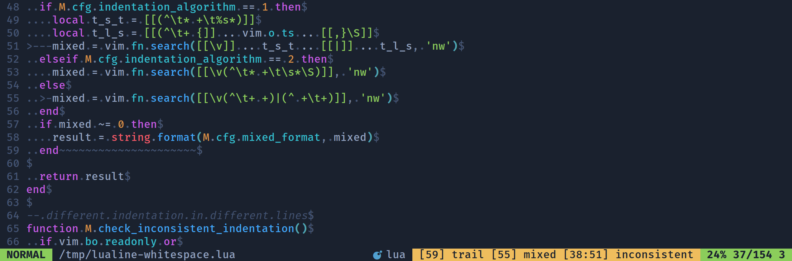

### Description

This plugin is [vim-airline](https://github.com/vim-airline/vim-airline)'s [whitespace](https://github.com/vim-airline/vim-airline#whitespace) extension ported to [lualine](https://github.com/nvim-lualine/lualine.nvim). It provides indication of trailing whitespace, mixed indentation and inconsistent indentation.



### Table Of Contents

- [Installation](#installation)
- [Integration](#integration)
- [Configuration](#configuration)

### Installation

Install via your preferred package manager:
- `deponian/nvim-lualine-whitespace`

Examples for some package managers:

#### vim-plug

```vim
Plug 'deponian/nvim-lualine-whitespace'
```

#### lazy

Import file below or directory it is contained on lazy setup.

```lua
return {
  "deponian/nvim-lualine-whitespace",
  version = "*",
  dependencies = {},
  config = function()
    require('lualine-whitespace').setup()
  end,
}
```

### Integration

```lua
-- setup before lualine setup()
require('lualine-whitespace').setup({
  ... -- see below for configuration options
})

require('lualine').setup({
  options = {
    ...
  },
  sections = {
    ...
    lualine_z = {
      -- shows only message about whitespaces in the end of line
      { require('lualine-whitespace').check_trailing_whitespaces },
      -- shows only message about mixed indentation within a line
      { require('lualine-whitespace').check_mixed_indentation },
      -- shows only message about different indentation on different lines
      { require('lualine-whitespace').check_inconsistent_indentation },
      -- show all that detected (see screenshot above)
      { require('lualine-whitespace').check_all }
    }
  }
})
```

### Configuration

These are default options. You can run empty `require('lualine-whitespace').setup()` if these options suit you.

```lua
require('lualine-whitespace').setup({
  -- Max number of lines in file where whitespace checking is enabled
  max_lines = 20000,

  -- Separator between trail/mixed/inconsistent indicators
  -- It's used in check_all function
  space = ' ',

  -- Format of trailing whitespace indicator. `%s` will be replaced with line number
  trailing_format = '[%s] trail',

  -- Format of mixed indentation indicator. `%s` will be replaced with line number
  mixed_format = '[%s] mixed',

  -- Format of inconsistent indentation indicator. `%s` will be replaced with line range
  inconsistent_format = '[%s] inconsistent',

  -- Disable specific whitespace checks for individual filetypes
  -- Table should look like this:
  -- { filetype1 = {'trailing', 'mixed', 'inconsistent'}, filetype2 = {'trailing'}, ... }
  -- 
  -- Default: {}
  -- 
  -- Vim-airline's default: {make = {'mixed', 'inconsistent'}}
  skip_check_ft = {},

  -- Which filetypes have special treatment of /* */ comments,
  -- matters for inconsistent indentation algorithm
  -- 
  -- Default: {}
  -- 
  -- Vim-airline's default: { 'arduino', 'c', 'cpp', 'cuda', 'go', 'javascript', 'ld', 'php' }
  c_like_langs = {},

  -- Customize the type of mixed indent checking to perform.
  -- 
  -- Algorithm 0: must be all spaces or all tabs before the first non-whitespace character
  -- 
  -- Algorithm 1: certain number of spaces are allowed after tabs, but not in between this
  -- algorithm works well for /* */ style comments in a tab-indented file
  -- 
  -- Algorithm 2: spaces are allowed after tabs, but not in between this algorithm works
  -- well with programming styles that use tabs for indentation and spaces for alignment
  -- 
  -- Default: `0`
  indentation_algorithm = 0
})
```

### Acknowledgements
Thanks to authors of original whitespace extension from [vim-airline](https://github.com/vim-airline/vim-airline) plugin.
